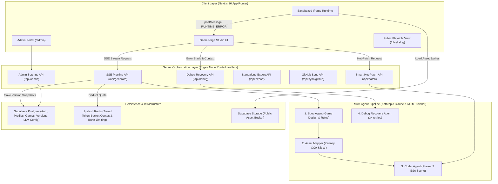

# GameForge AI: System Architecture & Implementation Plan

GameForge AI enables creators, educators, game designers, hobbyists, and hackathon participants to turn natural-language prompts into interactive 2D web games, complete with conversational hot-patching, automated runtime error recovery, public sharing, standalone export, and GitHub synchronization.

---

## 1. System Architecture Overview



---

## 2. Core Subsystems & Technical Decisions

### 2.1 Multi-Agent Pipeline & Orchestration
- **Runtime**: Next.js App Router Route Handler (`/api/generate`) returning a `ReadableStream` (Server-Sent Events). The handler pins `export const runtime = 'nodejs'` (the Anthropic SDK and a long-lived stream both require it), sends `X-Accel-Buffering: no` plus a periodic heartbeat comment frame, and aborts the pipeline on `request.signal`.
- **No latency commitment**: there is no hard end-to-end latency target. The pipeline runs Spec → Asset Mapper → Coder, and each agent's output is streamed as soon as it validates.
  - **Spec Agent**: Produces structured JSON `GameSpec` (title, genre, mechanics, player controls, win/loss conditions, entity definitions).
  - **Asset Mapper**: An LLM agent that matches entity definitions against a vetted, pre-indexed `lib/assets/catalog.json` (Kenney CC0 2D sprites) and assigns sound presets (`soundFx.play`). Its output is validated with Zod.
  - **Coder Agent**: Implements `class MainScene extends Phaser.Scene` with Arcade Physics (~150-250 lines), utilizing the injected canvas runner harness.
- **Run lifecycle**: every run persists a `game_versions` row, **including Coder Agent failures** (`is_stable = false`, `error_log` populated). A run aborted by client disconnect persists nothing and refunds its reserved token budget in full (§2.5). Generation is non-idempotent per request; there is no retry-on-reconnect.
- **Hot-Patch Router (`/api/patch`)**:
  - Logic/mechanic/tuning edits bypass the Spec Agent and go straight to the Coder Agent for a fast turnaround.
  - Novel entity/visual requests selectively invoke the Asset Mapper before the Coder Agent.
- **Model selection**: Anthropic-only implementation. The active model ID is read from `llm_configurations` and validated against `GET /v1/models` at startup, so no model ID is hardcoded in application code. The `provider` column is retained for future providers.

### 2.2 Sandboxed Iframe & PostMessage Bridge
- **Architecture**: the sandbox is a **same-host** static document at `/sandbox/index.html`, embedded as `<iframe sandbox="allow-scripts" allow="autoplay">`. Omitting `allow-same-origin` is what creates the opaque origin — the URL's host contributes nothing to isolation, so the dedicated `sandbox.<domain>` hostname is deferred to Phase 6. `allow="autoplay"` is a separate mechanism from `sandbox` and is what makes jsfxr audible. The frame loads vendored Phaser and jsfxr UMD builds plus `runner.js`; it imports nothing from the app bundle and carries no React or Next runtime.
- **CSP**: enforced as a real response header from `headers()` in `next.config.ts`, scoped to `/sandbox/:path*` and built by `lib/sandbox/csp.ts` from `getPublicEnv()`. Every source expression names an explicit origin — never `'self'`, which resolves against an opaque origin and matches nothing in WebKit, blanking the frame on Safari and iOS. `script-src` also carries `blob:` because `LOAD_CODE` injects the scene as a Blob URL script. No `'unsafe-eval'` is needed: Phaser 3.90.0's only `new Function` sits behind a `globalThis` guard that modern browsers never reach. `frame-ancestors` is effective only as a header, which is a further reason this is not a meta tag.
- **Sandbox script CORS**: `/sandbox/:path*` must also send `Access-Control-Allow-Origin: *`. ES modules are **always** fetched in CORS mode, unlike classic scripts, and the frame's opaque origin means every request carries `Origin: null`. Without this header the browser blocks `/sandbox/runner.js`, and because the failure is a silent module-load block, the frame renders its background but never boots — no canvas, no error, status stuck at `booting`. `*` is the only usable value (an opaque origin cannot be named) and these are public static assets with no credentials. This was found only by running a real browser; every HTTP-level check passed without it.
- **Assets**: sprites are served from a public Supabase Storage bucket rather than from `/public`. An opaque-origin frame sends `Origin: null` on every request, so the bucket must answer with `Access-Control-Allow-Origin: *`. Phaser loads textures with `crossOrigin="anonymous"`, which makes a missing header a hard load failure rather than merely a tainted canvas. This was confirmed by measurement before the asset pipeline was written.
- **Message validation**: sender identity, not origin strings, is the parent's authority. An opaque origin cannot be named in `targetOrigin`, so parent→child **must** use `"*"`; and every inbound message reports `event.origin === "null"`, which makes a forged and a legitimate message indistinguishable by origin. The parent therefore accepts a message only when `event.source === iframe.contentWindow` **and** the payload parses against its Zod schema. The frame mirrors this: it accepts the first message only if `event.source === window.parent`, pins that origin, and requires it thereafter.
- **Production deployment**: still requires a real subdomain (DNS record + platform domain) if the two-host model of Phase 6 is adopted. Nothing in Phase 2 validates that path, and `*.localhost` resolution in dev would not have validated it either.

- **Bridge Protocol**:
  - `PARENT -> IFRAME`: `LOAD_CODE` (builds a Blob URL `<script>` from the validated source, tears the previous instance down with `game.destroy(true)`, then boots a new game), `PAUSE_GAME`, `RESUME_GAME`, `RESTART_GAME`.
  - `IFRAME -> PARENT`: `SCENE_READY`, `HEARTBEAT`, `CONSOLE_LOG`, `RUNTIME_ERROR` (capturing `window.onerror` and `window.addEventListener('unhandledrejection')` with line number, message, and callstack). The runner instruments the injected scene so `SCENE_READY` means `create()` returned without throwing, and so each error is tagged with the failing phase (`preload` / `create` / `update`).
- **Boot semantics**: the SSE stream carries agent stage, status, and token progress only. The sandbox is booted solely after the complete `MainScene` passes Zod + parse validation — no partial or unvalidated code is ever loaded.
- **Audio Synthesizer**: vendored `jsfxr` (UMD build, loaded as a classic script) exposed to scenes as `soundFx`. jsfxr renders each effect to an in-memory WAV data URI, so the sandbox CSP must permit `media-src data:`. Presets are mapped rather than renamed: `laser → laserShoot`, `pickup → pickupCoin`, `hit → hitHurt`, `powerup → powerUp`, while `explosion` and `jump` already match.
- **Asset licensing**: Kenney packs are CC0 1.0, Phaser is MIT, and jsfxr is UNLICENSE; all recorded in `lib/assets/CREDITS.md`. Curated sprites are deliberately not committed — `lib/assets/curation.json` is the source of truth and `bun run assets:sync` uploads them and regenerates the committed `lib/assets/catalog.json`.

### 2.3 Automated Debug Agent & Rollback Loop
- **Probationary Grace Period**: After `LOAD_CODE`, the runner monitors the game for 3 seconds of clean execution (`preload()`, `create()`, and continuous `update()` frames). A `SCENE_READY` plus surviving-heartbeat sequence triggers a write-back to `PATCH /api/games/:id/versions/:versionId/stability` (service-role, owner-checked), which commits `is_stable = true` and updates `games.last_stable_version_id`.
- **Probation edge cases**:
  - Tab closed mid-probation: the callback never arrives, the version stays `is_stable = false`, and `last_stable_version_id` keeps pointing at the previous good version.
  - Hot-patch during probation: the pending probation is cancelled, never left orphaned, and the new version starts its own.
  - Duplicate or late callbacks: idempotent by `version_id`; a stability write for a version that is no longer `games.current_version_id` is ignored.
- **Failure Recovery Loop**:
  - If a runtime or syntax error fires during probation:
    1. PostMessage bridge forwards error payload (stack, message, failing code).
    2. Studio immediately calls `/api/debug` with failing source code, error trace, and game spec.
    3. Debug Agent generates a targeted surgical fix (up to 3 consecutive retries).
    4. If 3 attempts fail, the sandbox automatically reverts to `last_stable_version_id` and surfaces a clear diagnostic toast to the user.
- **Quota refund**: tokens consumed by a failed run are credited back per §2.5.

### 2.4 Database Schema (Supabase Postgres)
- **Strict Snake_Case** naming convention as mandated by `AGENTS.md`.
- Tables:
  1. `profiles`: `id` (UUID references `auth.users`), `email`, `role` (`'user'` | `'admin'`), `avatar_url`, `created_at`, `updated_at`.
  2. `games`: `id` (UUID), `user_id` (UUID references `profiles`), `title`, `description`, `genre`, `public_slug` (UNIQUE), `is_public` (BOOLEAN), `github_repo` (TEXT nullable), `current_version_id` (UUID nullable), `last_stable_version_id` (UUID nullable), `created_at`, `updated_at`.
  3. `game_versions`: `id` (UUID), `game_id` (UUID references `games`), `version_number` (INT), `prompt` (TEXT), `spec` (JSONB), `asset_manifest` (JSONB), `source_code` (TEXT), `is_stable` (BOOLEAN), `error_log` (TEXT nullable), `created_at`.
  4. `llm_configurations`: `id` (UUID), `agent_type` (`'spec_agent'` | `'asset_mapper'` | `'coder_agent'` | `'debug_agent'`), `provider` (`'anthropic'` | `'openai'` | `'google'` | `'groq'`), `model_name` (TEXT), `api_key_override_encrypted` (TEXT nullable), `is_active` (BOOLEAN), `updated_at`.
  5. `integrations`: `id` (UUID), `user_id` (UUID references `profiles`), `provider` (`'github'`), `access_token_encrypted` (TEXT), `created_at`, `updated_at`, UNIQUE(`user_id`, `provider`).
  6. `game_messages`: `id` (UUID), `game_id` (UUID references `games`), `user_id` (UUID references `profiles`), `role` (`'user'` | `'assistant'` | `'system'`), `content` (TEXT), `agent_type` (nullable), `provider` (nullable), `model_used` (TEXT), `tokens_used` (INT), `execution_time_ms` (INT), `is_fallback` (BOOLEAN), `fallback_reason` (TEXT nullable), `created_at`. Append-only conversational transcript for the hot-patch chat, with per-turn cost and fallback telemetry.
- **Constraints & integrity**:
  - `game_versions`: UNIQUE(`game_id`, `version_number`).
  - `version_number` is **not** computed with a racy `max() + 1`. A `SECURITY INVOKER` Postgres function takes `pg_advisory_xact_lock(game_id)` and returns the next number, making the unique constraint a correctness backstop rather than the race loser.
  - `games.current_version_id` and `games.last_stable_version_id` reference `game_versions(id)` `ON DELETE SET NULL`, and are added after both tables exist. Insert order for a first version is: insert `games` (both version FKs `NULL`) → insert `game_versions` → `UPDATE games SET current_version_id, last_stable_version_id`.
- **Secret encryption**: `api_key_override_encrypted` and `access_token_encrypted` hold AES-256-GCM ciphertext (per-row random IV, 32-byte key from `INTEGRATION_ENCRYPTION_KEY`). Ciphertext is never returned by any client-facing API; decryption happens only in server-only modules. See §2.7.
- **Route protection (two-tier)**: `proxy.ts` (Next.js 16's replacement for the now-deprecated `middleware.ts`) refreshes the Supabase session via `supabase.auth.getClaims()` and performs **optimistic** redirects only. It is scoped to `/admin/:path*` and `/api/admin/:path*` so no per-request database lookup happens elsewhere. Real authorization is enforced in a Data Access Layer (`lib/dal.ts`: `verifySession()` / `requireUser()` / `requireAdmin()`) that every Route Handler, Server Action, and admin page calls. Proxy coverage is never treated as authorization. `getClaims()` is used, never `getSession()`.
- **RLS**: enabled on every table. Policies use `TO <role>` plus an ownership predicate — never `auth.role()` — and UPDATE policies carry both `USING` and `WITH CHECK`.
  - `profiles`: owner-only SELECT/UPDATE, with `UPDATE (role)` **revoked** from `anon`/`authenticated` so a user cannot self-promote to admin.
  - `games`: owner-only SELECT plus public SELECT `WHERE is_public = true`; owner-only INSERT/UPDATE/DELETE.
  - `game_versions`: readable via the parent game's ownership or public flag; `error_log` is not exposed to `anon`.
  - `llm_configurations` and `integrations`: RLS enabled with **zero policies** (deny-all for `anon`/`authenticated`); server code reaches them via the service-role client.
- **Admin Bootstrapping**: `ADMIN_EMAILS` cannot be read from Postgres, so the role grant is applied app-side by an idempotent, server-side sync that promotes a signed-in profile whose email appears in `ADMIN_EMAILS`. Removing an address from the list does **not** demote; demotion is manual.
- **Public slugs**: auto-generated on first publish as `<slugified-title>-<4-char-suffix>` (e.g. `space-blaster-x7k2`), unique-constrained, and renameable later from Studio.

### 2.5 Rate Limiting & Tiered Quota
Two independent mechanisms, both on Upstash Redis:
- **Burst limiter**: `@upstash/ratelimit` sliding window, max 5 requests/minute per user. Never refunded.
- **Daily token budget**: a raw `@upstash/redis` counter at key `quota:{userId}:{yyyy-mm-dd}`, incremented on completion, decremented on failure or abort, expiring at the next UTC midnight. `@upstash/ratelimit`'s Token Bucket exposes only `limit()` and cannot credit tokens back, which is why the budget is implemented separately.
- Admins bypass both mechanisms.

### 2.6 Export & GitHub Sync
- **Standalone HTML Export**: Generates a self-contained single `index.html` file with **Phaser 3 inlined** (~1 MB, bundled at build time rather than fetched from a CDN), the inlined jsfxr synth, inlined asset data/URLs, and the scene code. Double-clickable and playable anywhere offline.
- **ZIP Bundle**: Generates a clean archive containing `index.html`, `main.js`, `assets/`, and a `package.json` with a lightweight Vite local server.
- **GitHub Sync**: Connects via **Supabase GitHub OAuth only** (no user-provided PAT) and uses `@octokit/rest` to push a repository with GitHub Actions pre-configured for instant GitHub Pages deployment. The access token is stored encrypted in `integrations` and is write-only — it is never returned by any API to the client.

### 2.7 Secret Encryption
- All third-party credentials (LLM API key overrides, GitHub access tokens) are encrypted with **AES-256-GCM** using `node:crypto`, a per-row random IV, and a 32-byte key supplied base64-encoded via `INTEGRATION_ENCRYPTION_KEY`.
- Encryption and decryption live in `server-only` modules; no client-reachable code path imports them.
- Supabase Vault is the documented alternative if key material should not live in environment variables.

---

## 3. Implementation Phasing & Milestones

### Phase 1: Database, Auth & Project Foundations
- [ ] Configure environment variables (`.env.local`) with `NEXT_PUBLIC_SUPABASE_URL`, `NEXT_PUBLIC_SUPABASE_PUBLISHABLE_KEY`, `SUPABASE_SERVICE_ROLE_KEY`, `INTEGRATION_ENCRYPTION_KEY`, `ADMIN_EMAILS`, `NEXT_PUBLIC_APP_ORIGIN`, and the Anthropic API key.
- [ ] Run Supabase CLI migrations (`supabase init` / `link` / `migration new`) to create tables (`profiles`, `games`, `game_versions`, `llm_configurations`, `integrations`) with RLS policies, constraints, and triggers. `supabase db advisors` must be clean before commit.
- [ ] Implement Supabase SSR clients (`@supabase/ssr`): browser, server, service-role (`server-only`), and the proxy session-refresh helper.
- [ ] Implement `proxy.ts` (Next.js 16's replacement for `middleware.ts`) scoped to `/admin/:path*` and `/api/admin/:path*`, performing session refresh and optimistic redirects only.
- [ ] Implement the Data Access Layer (`lib/dal.ts`: `verifySession()` / `requireUser()` / `requireAdmin()`) and call it from every Route Handler and Server Action.
- [ ] Implement email/password and Google OAuth auth flow with zod-validated forms.

### Phase 2: Asset Manifest & Sandbox Runner Harness
- [x] Curate Kenney CC0 sprites through `lib/assets/curation.json`, uploaded to the public `game-assets` Supabase Storage bucket by `scripts/seed-assets.ts`, with attribution in `lib/assets/CREDITS.md`.
- [x] Generate `lib/assets/catalog.json` (tags, dimensions, object paths) via `bun run assets:sync`, with `bun run assets:check` for curation drift and bucket/ACAO verification. Requires the curated PNGs to be present in a gitignored `assets-src/`.
- [x] Build the same-host opaque-origin sandbox host at `/sandbox/index.html` with vendored Phaser 3.90.0 and jsfxr, governed by an egress-locked CSP header emitted from `next.config.ts`.
- [x] Implement the bidirectional PostMessage bridge using sender identity (`event.source`) plus Zod validation on both sides, with error capture (`window.onerror`, `unhandledrejection`, `console.error`) and failing-phase tagging.
- [x] Add a dev-only harness at `/dev/sandbox` driving `LOAD_CODE` / `PAUSE_GAME` / `RESUME_GAME` / `RESTART_GAME`, plus probes for a forged source and a schema-invalid payload.
- [ ] Outstanding: populate `assets-src/` with the four Kenney packs and run `assets:sync`, then complete the browser checks in §4 (in particular the Safari/iOS render check).

### Phase 3: Multi-Agent Pipeline & Route Handlers
- [ ] Set up the Anthropic-only Claude client (model ID read from `llm_configurations`, validated against `GET /v1/models`).
- [ ] Implement `Spec Agent`: Prompts and schema validation (Zod) for GameSpec.
- [ ] Implement `Asset Mapper`: LLM-assisted entity-to-asset matching against `lib/assets/catalog.json`, validated with Zod.
- [ ] Implement `Coder Agent`: High-performance Phaser 3 ES6 MainScene generator.
- [ ] Implement SSE Streaming Route Handler (`/api/generate/route.ts`) with `runtime = 'nodejs'`, heartbeat frames, abort handling, and always-persist-on-failure.

### Phase 4: Studio UI & Conversational Hot-Patching
- [ ] Build the Studio Layout: Prompt input, multi-stage agent progress stepper, sandboxed preview panel.
- [ ] Build runtime controls: Play, Pause, Restart, Sound mute, Fullscreen toggle.
- [ ] Implement Conversational Chat & Smart Hot-Patch Router (`/api/patch/route.ts`).
- [ ] Implement the Version Timeline drawer (inspect past snapshots, rollback).
- [ ] Boot the sandbox only after the complete `MainScene` passes Zod + parse validation.

### Phase 5: Debug Agent & Automated Self-Healing
- [ ] Build the 3-second grace period stability monitor and the stability write-back endpoint (idempotent by version id).
- [ ] Implement `/api/debug/route.ts` with surgical fix prompts.
- [ ] Wire the automatic 3x retry loop with automatic rollback to `last_stable_version_id`.
- [ ] Wire token-budget refunds for failed and aborted runs.

### Phase 6: Admin Portal, Quotas & Distribution
- [ ] Implement the Upstash burst limiter (sliding window) and the separate, refundable daily token budget in raw `@upstash/redis`, with admin bypass.
- [ ] Build `/admin` dashboard for model/provider selection and encrypted, write-only API key overrides.
- [ ] Implement Standalone Single-File HTML (Phaser 3 inlined) and ZIP bundle generation.
- [ ] Implement `/play/[slug]` public playable route with OpenGraph tags and auto-generated slugs.
- [ ] Implement GitHub Sync via Supabase GitHub OAuth only (token encrypted in `integrations`, never returned to clients), using `@octokit/rest`.

---

## 4. Verification

After each phase, run:

```bash
bun run check-types
bun run lint
bun test
```

`bun run build` is deliberately not run locally (see `AGENTS.md`); the deploy platform
performs it.

Manual checks per phase:
- **Phase 1**: a non-admin receives 403 on `/admin` and `/api/admin/*` (401 when anonymous); a signed-in user cannot raise their own `role`; anon can read public games only; `integrations` and `llm_configurations` are unreadable by any client; `supabase db advisors` reports no findings.
- **Phase 2**: `bun test` covers protocol drift, bridge acceptance, CSP shape, and catalog schema. On `/dev/sandbox`: the frame renders with no CSP violations; `document.cookie` is empty and `window.parent.document` throws inside the frame; a sprite loads from the bucket and a canvas read-back (`game.renderer.snapshot()`) succeeds, proving the canvas is not tainted; a message dispatched from a foreign `source` is ignored, as is a schema-invalid payload from the correct source; the failing fixture surfaces `RUNTIME_ERROR` and Restart recovers; audio plays after a click inside the frame; and the frame renders in Safari/iOS, where a `'self'`-based policy would have failed silently.

  **Measured results (Chromium, 2026-09-11).** An in-frame diagnostic reported `ORIGIN=null | COOKIE=blocked:SecurityError | PARENT_DOC=blocked:SecurityError | LOCALSTORAGE=blocked:SecurityError | SNAPSHOT=ok`, confirming the opaque origin, all three isolation blocks, and an untainted canvas with a cross-origin sprite drawn. Verified end to end: real Kenney sprite fetched from the bucket as an XHR and rendered; `LOAD_CODE` → Blob script → Phaser 3.90.0 boot → `SCENE_READY` → `running`; console forwarding; Pause/Resume/Restart; the failing fixture reporting `update: Fixture runtime failure`; and both security probes rejected. Not verified: **Safari/iOS**, which cannot be exercised on Windows — the `'self'`-based CSP regression remains untested there. Audible output was not verifiable in headless Chromium (no audio device), though no `media-src` violation occurred, which was the actual risk given jsfxr's data: URIs.
- **Phase 3**: a Zod-invalid `GameSpec` is rejected; an aborted run persists nothing and refunds its token budget.
- **Phase 4**: no partial code is ever booted into the sandbox.
- **Phase 5**: a forced runtime error triggers 3 retries and then rolls back to `last_stable_version_id`.
- **Phase 6**: a failed run's tokens are credited back and the burst limiter is unaffected.
