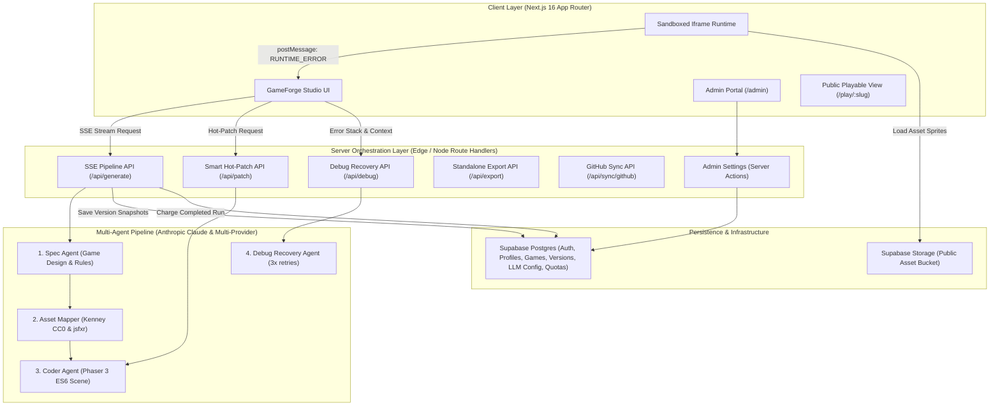

# GameForge AI: System Architecture & Implementation Plan

GameForge AI enables creators, educators, game designers, hobbyists, and hackathon participants to turn natural-language prompts into interactive 2D web games, complete with conversational hot-patching, automated runtime error recovery, public sharing, standalone export, and GitHub synchronization.

---

## 1. System Architecture Overview



---

## 2. Core Subsystems & Technical Decisions

### 2.1 Multi-Agent Pipeline & Orchestration
- **Runtime**: Next.js App Router Route Handler (`/api/generate`) returning a `ReadableStream` (Server-Sent Events). The handler pins `export const runtime = 'nodejs'` (the Anthropic SDK and a long-lived stream both require it), sends `X-Accel-Buffering: no` plus a periodic heartbeat comment frame, and aborts the pipeline on `request.signal`.
- **No latency commitment**: there is no hard end-to-end latency target. The pipeline runs Spec → Asset Mapper → Coder, and each agent's output is streamed as soon as it validates.
  - **Spec Agent**: Produces structured JSON `GameSpec` (title, genre, mechanics, player controls, win/loss conditions, entity definitions).
  - **Asset Mapper**: An LLM agent that matches entity definitions against a vetted, pre-indexed `lib/assets/catalog.json` (Kenney CC0 2D sprites) and assigns sound presets (`soundFx.play`). Its output is validated with Zod.
  - **Coder Agent**: Implements `class MainScene extends Phaser.Scene` with Arcade Physics (~150-250 lines), utilizing the injected canvas runner harness.
- **Run lifecycle**: a run performs exactly one database write, issued only at a terminal state. Success persists a `game_versions` row plus the game and transcript rows; a Coder Agent failure persists the same shape with `is_stable = false` and `error_log` populated, still carrying the spec and manifest that did validate. A **Spec** failure persists nothing — there is no design, manifest, or code to snapshot. A run aborted by a client disconnect persists nothing at all, because the write is never issued; it is also never charged, since a charge is written only at a terminal state (§2.5). Generation is non-idempotent per request; there is no retry-on-reconnect.
- **Asset Mapper is advisory**: an invalid or failed mapping degrades the run rather than failing it. Every entity falls back to procedural pixel art drawn by the Coder via a dictated `makeTexturedSprite` helper, and the stream carries a `warning` frame. Only an abort stops the run at that stage.
- **Stability is not a generation-time claim**: `is_stable` is false on insert even for a successful run, and `games.last_stable_version_id` is never written by Phase 3. Both belong to the sandbox probation callback in §2.3.
- **Hot-Patch Router (`/api/patch`)**:
  - Logic/mechanic/tuning edits bypass the Spec Agent and go straight to the Coder Agent for a fast turnaround.
  - Novel entity/visual requests selectively invoke the Asset Mapper before the Coder Agent.
- **Model selection**: the models are Claude, reached through an OpenAI-compatible gateway. The active model ID is read from `llm_configurations` per run and validated against the gateway's `GET /v1/models`, fetched lazily and cached once per process, so no model ID is hardcoded in application code. An unrecognised model fails the run with `model_unavailable` rather than being silently replaced. `claude-sonnet-5` is confirmed offered by the gateway. The `provider` column stays `'anthropic'`, which still describes the model, and a row naming any other provider is rejected outright. The credential is the stored gateway key override when one exists, else `ANTHROPIC_API_KEY`; either way the override is encrypted at rest and never returned to a client (§2.7). Forced tool calls survive the translation: the gateway maps `tool_choice` through to a real Anthropic tool use (`toolu_…` ids) and returns both `prompt_tokens` and `input_tokens`.
- **Gateway content filter**: the WAF in front of the gateway answers HTTP 403 with an HTML block page for prompt text it dislikes. Measured cause: the coder prompt's phrase "injected as a classic `<script>`" — a textbook XSS signature. Rewording that one sentence cleared it with no loss of guidance, so the rules were not diluted. `provider_content_blocked` is reported distinctly from `provider_auth_failed`, because conflating them sends debugging toward the credential instead of the prompt.

### 2.2 Sandboxed Iframe & PostMessage Bridge
- **Architecture**: the sandbox is a **same-host** static document at `/sandbox/index.html`, embedded as `<iframe sandbox="allow-scripts" allow="autoplay">`. Omitting `allow-same-origin` is what creates the opaque origin — the URL's host contributes nothing to isolation, so a dedicated `sandbox.<domain>` hostname would add DNS and platform-domain work without buying any. It is not adopted by any phase in this document. `allow="autoplay"` is a separate mechanism from `sandbox` and is what makes jsfxr audible. The frame loads vendored Phaser and jsfxr UMD builds plus `runner.js`; it imports nothing from the app bundle and carries no React or Next runtime.
- **CSP**: enforced as a real response header from `headers()` in `next.config.ts`, scoped to `/sandbox/:path*` and built by `lib/sandbox/csp.ts` from `getPublicEnv()`. Every source expression names an explicit origin — never `'self'`, which resolves against an opaque origin and matches nothing in WebKit, blanking the frame on Safari and iOS. `script-src` also carries `blob:` because `LOAD_CODE` injects the scene as a Blob URL script. No `'unsafe-eval'` is needed: Phaser 3.90.0's only `new Function` sits behind a `globalThis` guard that modern browsers never reach. `frame-ancestors` is effective only as a header, which is a further reason this is not a meta tag.
- **Sandbox script CORS**: `/sandbox/:path*` must also send `Access-Control-Allow-Origin: *`. ES modules are **always** fetched in CORS mode, unlike classic scripts, and the frame's opaque origin means every request carries `Origin: null`. Without this header the browser blocks `/sandbox/runner.js`, and because the failure is a silent module-load block, the frame renders its background but never boots — no canvas, no error, status stuck at `booting`. `*` is the only usable value (an opaque origin cannot be named) and these are public static assets with no credentials. This was found only by running a real browser; every HTTP-level check passed without it.
- **Assets**: sprites are served from a public Supabase Storage bucket rather than from `/public`. An opaque-origin frame sends `Origin: null` on every request, so the bucket must answer with `Access-Control-Allow-Origin: *`. Phaser loads textures with `crossOrigin="anonymous"`, which makes a missing header a hard load failure rather than merely a tainted canvas. This was confirmed by measurement before the asset pipeline was written.
- **Message validation**: sender identity, not origin strings, is the parent's authority. An opaque origin cannot be named in `targetOrigin`, so parent→child **must** use `"*"`; and every inbound message reports `event.origin === "null"`, which makes a forged and a legitimate message indistinguishable by origin. The parent therefore accepts a message only when `event.source === iframe.contentWindow` **and** the payload parses against its Zod schema. The frame mirrors this: it accepts the first message only if `event.source === window.parent`, pins that origin, and requires it thereafter.
- **Production deployment**: the two-host model (a dedicated sandbox subdomain) is **not adopted**. The opaque origin already isolates the frame, so a separate hostname would add a DNS record and platform-domain configuration for no security gain. Nothing in Phase 2 validated that path, and `*.localhost` resolution in dev would not have validated it either. If it is ever wanted it belongs to a later phase, not to Phase 6.

- **Bridge Protocol**:
  - `PARENT -> IFRAME`: `LOAD_CODE` (builds a Blob URL `<script>` from the validated source, tears the previous instance down with `game.destroy(true)`, then boots a new game), `PAUSE_GAME`, `RESUME_GAME`, `RESTART_GAME`.
  - `IFRAME -> PARENT`: `SCENE_READY`, `HEARTBEAT`, `CONSOLE_LOG`, `RUNTIME_ERROR` (capturing `window.onerror` and `window.addEventListener('unhandledrejection')` with line number, message, and callstack). The runner instruments the injected scene so `SCENE_READY` means `create()` returned without throwing, and so each error is tagged with the failing phase (`preload` / `create` / `update`).
- **Boot semantics**: the SSE stream carries agent stage, status, and token progress only. The sandbox is booted solely after the complete `MainScene` passes Zod + parse validation — no partial or unvalidated code is ever loaded.
- **Audio Synthesizer**: vendored `jsfxr` (UMD build, loaded as a classic script) exposed to scenes as `soundFx`. jsfxr renders each effect to an in-memory WAV data URI, so the sandbox CSP must permit `media-src data:`. Presets are mapped rather than renamed: `laser → laserShoot`, `pickup → pickupCoin`, `hit → hitHurt`, `powerup → powerUp`, while `explosion` and `jump` already match.
- **Asset licensing**: Kenney packs are CC0 1.0, Phaser is MIT, and jsfxr is UNLICENSE; all recorded in `lib/assets/CREDITS.md`. Curated sprites are deliberately not committed — `lib/assets/curation.json` is the source of truth and `bun run assets:sync` uploads them and regenerates the committed `lib/assets/catalog.json`.

### 2.3 Automated Debug Agent & Rollback Loop
- **Probationary Grace Period**: After `LOAD_CODE`, the runner monitors the game for a 3-second window of error-free execution (`preload()`, `create()`, and a live `update()` loop). The window is wall-clock and suspended while the document is hidden or the game is paused, so neither a throttled background tab (rAF falls to ~0 when hidden) nor the Pause control can stall or fail a probation. `SCENE_READY` plus an error-free window triggers a write-back to `PATCH /api/games/:id/versions/:versionId/stability` (session-authenticated, service-role, owner-checked), whose `commit_version_stability` function sets `is_stable = true` and, for a debug candidate, promotes `games.current_version_id` in the same atomic call. `is_stable` is **product state, not a security boundary**: the browser is the only witness that the game ran, so the claim is trusted and scoped to the version's owner. Nothing server-side re-verifies it, by design.
- **Bounded probation**: a candidate that has not reached `SCENE_READY` within a 10-second boot deadline (a hang, a stalled `preload`, a script that never loads) is a failed attempt, not an open wait. The loop always terminates.
- **Probation edge cases**:
  - Tab closed mid-probation: the callback never arrives, the version stays `is_stable = false`, and `last_stable_version_id` keeps pointing at the previous good version.
  - Hot-patch during probation: probation exists only as the Studio's client-side timer, so a hot-patch clears it; there is no server-side probation state to orphan.
  - Duplicate or late callbacks: idempotent by `version_id`. Re-confirming the already-current version is a no-op, and a candidate whose base has since been superseded is never promoted — an explicit user action always outranks the automatic repair.
- **Failure Recovery Loop**:
  1. The PostMessage bridge forwards the error payload (message, line, callstack, failing phase).
  2. The pointer is made safe **immediately**, not after three attempts and before the model is even resolved: when the failing version is the game's current one, `games.current_version_id` is repointed at `last_stable_version_id` by the idempotent `reset_game_current_to_stable` function (same row lock as `persist_generation`), or set to `NULL` when no stable version exists. Repairing an older snapshot leaves the pointer alone, so debugging history cannot drag a newer version off the game. The broken version is kept as an immutable snapshot and never mutated, so a reload never re-boots known-broken code.
  3. The Studio calls `POST /api/debug` with the failing version's source, the error trace (clipped to a bounded size), and the stored spec. The call claims the user's run slot for its duration, exactly as `/api/generate` and `/api/patch` do.
  4. The Debug Agent returns one surgical fix. The server runs the boot gate (`inspectSceneSource`) and writes exactly one `game_versions` row: the fix as a **non-promoted, non-stable** candidate when it passes, or a source-less tombstone when it does not, so an unusable answer still consumes an attempt. `debug_of_version_id` names the session root — the original broken version, carried unchanged through the whole chain. The client boots a candidate and probation repeats.
  5. On proof, the stability write commits the candidate (`is_stable = true` and promotion in the same branch, so the stable flag and `last_stable_version_id` cannot disagree), guarded so a version promoted by the user in the meantime is never overwritten.
- **Attempt limit is server-enforced**: the attempt count is the number of candidates already rooted at the session root (`debug_of_version_id`, which defaults to the version's own id for the first failure), so a page reload cannot reset it and a fourth `/api/debug` call is refused idempotently rather than starting a fourth attempt. There is no client `for` loop and no session table. After the third failure the loop ends in the state from step 2: `current_version_id` at `last_stable_version_id`, or — for a first-ever version with no stable target — `NULL` plus a terminal "couldn't repair this game" prompt offering regeneration from the stored prompt.
- **Debug-agent config**: a Phase 5 migration inserts the active `debug_agent` row into `llm_configurations` (same provider and model as the coder), so the loop is not blocked on the Phase 6 admin dashboard that later edits it.
- **Quota cost**: a failed or aborted `generate`/`patch` run is free, and a repair attempt is billed only when it reached the model. The budget is incremented at the terminal state and never decremented, so there is no refund path at all — see §2.5.

### 2.4 Database Schema (Supabase Postgres)
- **Strict Snake_Case** naming convention as mandated by `AGENTS.md`.
- Tables:
  1. `profiles`: `id` (UUID references `auth.users`), `email`, `role` (`'user'` | `'admin'`), `avatar_url`, `created_at`, `updated_at`.
  2. `games`: `id` (UUID), `user_id` (UUID references `profiles`), `title`, `description`, `genre`, `public_slug` (UNIQUE), `is_public` (BOOLEAN), `github_repo` (TEXT nullable), `current_version_id` (UUID nullable), `last_stable_version_id` (UUID nullable), `created_at`, `updated_at`.
  3. `game_versions`: `id` (UUID), `game_id` (UUID references `games`), `version_number` (INT), `prompt` (TEXT), `spec` (JSONB), `asset_manifest` (JSONB), `source_code` (TEXT), `is_stable` (BOOLEAN), `error_log` (TEXT nullable), `debug_of_version_id` (UUID nullable references `game_versions`), `created_at`. A non-null `debug_of_version_id` marks a self-healing candidate and names the broken version it repairs; candidates are persisted non-promoted and are never offered as rollback targets.
  4. `llm_configurations`: `id` (UUID), `agent_type` (`'spec_agent'` | `'asset_mapper'` | `'coder_agent'` | `'debug_agent'`), `provider` (`'anthropic'` | `'openai'` | `'google'` | `'groq'`), `model_name` (TEXT), `api_key_override_encrypted` (TEXT nullable), `is_active` (BOOLEAN), `updated_at`.
  5. `integrations`: `id` (UUID), `user_id` (UUID references `profiles`), `provider` (`'github'`), `access_token_encrypted` (TEXT), `created_at`, `updated_at`, UNIQUE(`user_id`, `provider`).
  6. `game_messages`: `id` (UUID), `game_id` (UUID references `games`), `user_id` (UUID references `profiles`), `role` (`'user'` | `'assistant'` | `'system'`), `content` (TEXT), `agent_type` (nullable), `provider` (nullable), `model_used` (TEXT), `tokens_used` (INT), `execution_time_ms` (INT), `is_fallback` (BOOLEAN), `fallback_reason` (TEXT nullable), `created_at`. Append-only conversational transcript for the hot-patch chat, with per-turn cost and fallback telemetry.
- Two further tables are operational rather than domain state, and are documented where they are used: `generation_runs`, the per-user run lease (§3 Phase 4), and `user_token_usage`, the daily token counter (§2.5).
- **Constraints & integrity**:
  - `game_versions`: UNIQUE(`game_id`, `version_number`).
  - `version_number` is **not** computed with a racy `max() + 1`. A `SECURITY INVOKER` Postgres function takes `pg_advisory_xact_lock(game_id)` and returns the next number, making the unique constraint a correctness backstop rather than the race loser.
  - `games.current_version_id` and `games.last_stable_version_id` reference `game_versions(id)` `ON DELETE SET NULL`, and are added after both tables exist. Insert order for a first version is: insert `games` (both version FKs `NULL`) → insert `game_versions` → `UPDATE games SET current_version_id, last_stable_version_id`.
- **Secret encryption**: `api_key_override_encrypted` and `access_token_encrypted` hold AES-256-GCM ciphertext (per-row random IV, 32-byte key from `INTEGRATION_ENCRYPTION_KEY`). Ciphertext is never returned by any client-facing API; decryption happens only in server-only modules. See §2.7.
- **Route protection (two-tier)**: `proxy.ts` (Next.js 16's replacement for the now-deprecated `middleware.ts`) refreshes the Supabase session via `supabase.auth.getClaims()` and performs **optimistic** redirects only. It is scoped to `/admin/:path*` and `/api/admin/:path*` so no per-request database lookup happens elsewhere. Real authorization is enforced in a Data Access Layer (`lib/dal.ts`: `getCurrentProfile()` / `requireUser()` / `requireAdmin()`) that every Route Handler, Server Action, and admin page calls. Proxy coverage is never treated as authorization. `getClaims()` is used, never `getSession()`.
- **RLS**: enabled on every table. Policies use `TO <role>` plus an ownership predicate — never `auth.role()` — and UPDATE policies carry both `USING` and `WITH CHECK`.
  - `profiles`: owner-only SELECT/UPDATE, with `UPDATE (role)` **revoked** from `anon`/`authenticated` so a user cannot self-promote to admin.
  - `games`: owner-only SELECT plus public SELECT `WHERE is_public = true`; owner-only INSERT/UPDATE/DELETE.
  - `game_versions`: readable via the parent game's ownership or public flag; `error_log` is not exposed to `anon`.
  - `llm_configurations` and `integrations`: RLS enabled with **zero policies** (deny-all for `anon`/`authenticated`); server code reaches them via the service-role client.
- **Admin Bootstrapping**: `ADMIN_EMAILS` cannot be read from Postgres, so the role grant is applied app-side by an idempotent, server-side sync that promotes a signed-in profile whose email appears in `ADMIN_EMAILS`. Removing an address from the list does **not** demote; demotion is manual.
- **Public slugs**: auto-generated on first publish as `<slugified-title>-<4-char-suffix>` (e.g. `space-blaster-x7k2`), unique-constrained, and renameable later from Studio.
- **Deployed schema reality (discovered in Phase 3)**: the linked Supabase project's `games` and `game_versions` tables are an **older prototype's** shape, not the one the Phase 1 migrations declare — `slug`/`status`/`is_published`/`plays_count`/`thumbnail_url` and `code`/`change_summary`/`created_by_agent`/`is_fallback_used`. The migration history records Phase 1 as applied and its functions (`next_version_number`, `handle_new_user`, `set_updated_at`) do exist, so the two tables were replaced afterwards; four legacy game rows remain, one written the same day. `20260911173544_reconcile_remote_games_schema.sql` closes the gap **additively**: it adds the declared columns, copies `slug` → `public_slug` and `code` → `source_code`, backfills `is_public` from `is_published`, adds the missing `unique (game_id, version_number)` and the `is_stable` partial index, relaxes the two legacy `NOT NULL`s that blocked a declared-schema insert, and renames or drops nothing. Without it `persist_generation` can never succeed. Two known debts follow: legacy columns now duplicate declared ones, and the live RLS policies still key off `is_published` rather than `is_public`. The same remote also carries prototype tables that **no migration declares** — `llm_configs`, `prompt_logs` and `usage_logs` — and they, not the declared schema, are the source of most of the `supabase db advisors` warnings (mutable `search_path`, `SECURITY DEFINER` functions executable by `anon`, and per-row `auth.*` re-evaluation in their RLS policies). Phase 6 adds its own objects cleanly: `user_token_usage` and the three quota functions are advisor-clean.

### 2.5 Rate Limiting & Daily Token Budget
Two limits, both in Postgres. There is no Redis: the burst window is derived from state the run guard already writes, and the budget is a counter beside the data it summarises, so neither adds a vendor, a dependency, an environment variable pair, or a second failure domain.

- **Burst limiter**: a sliding window over `generation_runs`, counting a user's rows with `started_at > now() - interval '1 minute'` against `RUN_BURST_PER_MINUTE` (default 5). `generation_runs_user_id_started_at_idx` already serves the count, so no new state is needed. Never refunded.
- **Daily token budget**: `public.user_token_usage(user_id, day, tokens_used)`, keyed by the UTC day the **database** computes rather than a date a caller supplies. `add_token_usage` upserts the increment atomically, `token_usage_today` reads it, and `check_run_allowed` compares it against `DAILY_TOKEN_BUDGET` (default 250,000).
- **Charging is the whole refund story.** The budget is incremented only at a terminal state and never decremented. A completed `/api/generate` or `/api/patch` run is charged its input+output tokens; a failed or aborted one is charged nothing; every `/api/debug` attempt that reached the model is charged, including a boot-gate tombstone. Because nothing is charged up front, there is nothing to credit back — the earlier design's charge-then-refund path is deleted rather than reimplemented.
- **Enforcement**: `check_run_allowed` runs in every route *before* the run slot is claimed, so a refused caller never takes the slot and never reaches a billable call. `rate_limited` and `quota_exceeded` are separate codes because they have separate remedies — both map to HTTP 429. Charging happens in the same `finally` that releases the run slot, and is best-effort: under-charging is the safe direction for a spend guard.
- **Admins bypass both mechanisms**, and the Studio header shows the signed-in user's daily budget as a percent bar (`Unlimited` for admins).
- **Configurability**: `DAILY_TOKEN_BUDGET` and `RUN_BURST_PER_MINUTE` are environment variables with defaults in `lib/env/server.ts`, because the ceiling is policy, not schema.
- **Known limit of the guard**: a charge is written in the route's `finally`, so a process killed between the model call and the terminal state under-charges. That is deliberate — the guard is a spend ceiling, not a security boundary.

### 2.6 Export & GitHub Sync (Phase 7)
- **Standalone HTML Export**: Generates a self-contained single `index.html` file with **Phaser 3 inlined** (~1 MB, bundled at build time rather than fetched from a CDN), the inlined jsfxr synth, inlined asset data/URLs, and the scene code. Double-clickable and playable anywhere offline.
- **ZIP Bundle**: Generates a clean archive containing `index.html`, `main.js`, `assets/`, and a `package.json` with a lightweight Vite local server.
- **GitHub Sync**: Connects via **Supabase GitHub OAuth only** (no user-provided PAT) and uses `@octokit/rest` to push a repository with GitHub Actions pre-configured for instant GitHub Pages deployment. The access token is stored encrypted in `integrations` and is write-only — it is never returned by any API to the client.

### 2.7 Secret Encryption (Phase 6)
- All third-party credentials (the gateway API key override, GitHub access tokens) are encrypted with **AES-256-GCM** using `node:crypto`, a per-row random IV, and a 32-byte key supplied base64-encoded via `INTEGRATION_ENCRYPTION_KEY`.
- Encryption and decryption live in `server-only` modules; no client-reachable code path imports them. The ciphertext format is versioned (`v1:<iv>:<tag>:<ciphertext>`) so an algorithm change can read the old format alongside the new one.
- A key that cannot be decrypted, a key of the wrong length, and a missing key each fail closed with their own error code. There is **no** fallback to `ANTHROPIC_API_KEY`: a misconfiguration must not look like a working override.
- The key is required in production (checked on the first read of server env) and optional in development, where an app with no stored override runs without it.
- Supabase Vault is the documented alternative if key material should not live in environment variables.

---

## 3. Implementation Phasing & Milestones

### Phase 1: Database, Auth & Project Foundations
- [ ] Configure environment variables (`.env.local`) with `NEXT_PUBLIC_SUPABASE_URL`, `NEXT_PUBLIC_SUPABASE_PUBLISHABLE_KEY`, `SUPABASE_SERVICE_ROLE_KEY`, `INTEGRATION_ENCRYPTION_KEY`, `ADMIN_EMAILS`, `NEXT_PUBLIC_APP_ORIGIN`, and the Anthropic API key.
- [ ] Run Supabase CLI migrations (`supabase init` / `link` / `migration new`) to create tables (`profiles`, `games`, `game_versions`, `llm_configurations`, `integrations`) with RLS policies, constraints, and triggers. `supabase db advisors` must be clean before commit.
- [ ] Implement Supabase SSR clients (`@supabase/ssr`): browser, server, service-role (`server-only`), and the proxy session-refresh helper.
- [ ] Implement `proxy.ts` (Next.js 16's replacement for `middleware.ts`) scoped to `/admin/:path*` and `/api/admin/:path*`, performing session refresh and optimistic redirects only.
- [ ] Implement the Data Access Layer (`lib/dal.ts`: `verifySession()` / `requireUser()` / `requireAdmin()`) and call it from every Route Handler and Server Action.
- [ ] Implement email/password and Google OAuth auth flow with zod-validated forms.

### Phase 2: Asset Manifest & Sandbox Runner Harness
- [x] Curate Kenney CC0 sprites through `lib/assets/curation.json`, uploaded to the public `game-assets` Supabase Storage bucket by `scripts/seed-assets.ts`, with attribution in `lib/assets/CREDITS.md`.
- [x] Generate `lib/assets/catalog.json` (tags, dimensions, object paths) via `bun run assets:sync`, with `bun run assets:check` for curation drift and bucket/ACAO verification. Requires the curated PNGs to be present in a gitignored `assets-src/`.
- [x] Build the same-host opaque-origin sandbox host at `/sandbox/index.html` with vendored Phaser 3.90.0 and jsfxr, governed by an egress-locked CSP header emitted from `next.config.ts`.
- [x] Implement the bidirectional PostMessage bridge using sender identity (`event.source`) plus Zod validation on both sides, with error capture (`window.onerror`, `unhandledrejection`, `console.error`) and failing-phase tagging.
- [x] Add a dev-only harness at `/dev/sandbox` driving `LOAD_CODE` / `PAUSE_GAME` / `RESUME_GAME` / `RESTART_GAME`, plus probes for a forged source and a schema-invalid payload.
- [ ] Outstanding: populate `assets-src/` with the four Kenney packs and run `assets:sync`, then complete the browser checks in §4 (in particular the Safari/iOS render check).

### Phase 3: Multi-Agent Pipeline & Route Handlers
- [x] Set up the Claude client. **Not** `@anthropic-ai/sdk`: the deployment reaches Claude through the Elice serverless gateway, which implements `GET /v1/models` and `POST /v1/chat/completions` but returns 404 for `/v1/messages` (measured). The transport is therefore a small `fetch` client in `lib/llm/chat-completions.ts` speaking OpenAI Chat Completions with `Authorization: Bearer <token>`, behind the vendor-neutral `LlmClient` interface. Model ID is read from `llm_configurations` and validated against `GET /v1/models` once per process; an unknown model fails the run rather than silently downgrading. Dropping the SDK added no dependency.
- [x] Implement `Spec Agent` (`lib/agents/spec`): `gameSpecSchema` (canonical entity model, refined so entity ids are unique and one entity is the player) submitted via a forced tool call, then re-parsed with Zod. Its prompt carries the catalog's tag vocabulary so `assetTags` name assets that exist.
- [x] Implement `Asset Mapper` (`lib/agents/asset-mapper`): the whole renderable catalog in-context, forced tool call, `resolveManifest` verifying every returned `assetId` against the catalog and giving every entity a slot (`null` = no match). Spritesheets are withheld from candidates because the runner only loads whole images.
- [x] Implement `Coder Agent` (`lib/agents/coder`): returns the scene as plain text — JSON-escaping 250 lines of code is a worse risk than fence-stripping — normalized by `normalizeSceneSource`, which is the *only* inspection Phase 3 performs on it.
- [x] Implement SSE Streaming Route Handler (`/api/generate/route.ts`) with `runtime = 'nodejs'`, `maxDuration = 300`, heartbeat comment frames, `request.signal` threaded into every model call, and pre-stream failures returned as real HTTP statuses.
- [x] Atomic persistence: one `persist_generation` Postgres function performs the only write of a run — creating the game if needed, inserting the version, moving `current_version_id`, and appending both transcript rows. It is invoked only at a terminal, non-aborted state.
- [x] Apply `20260911105845_phase3_llm_config_and_persist.sql` and `20260911173544_reconcile_remote_games_schema.sql` to the remote project (`supabase db push`; no Docker required — only `db start`/`db reset`/`db diff` and `db push --local` need a local database).
- [ ] Outstanding: boot a generated `MainScene` in the sandbox via `/dev/sandbox` to confirm `SCENE_READY`, and exercise `/api/generate` over HTTP (the pipeline is verified in-process, the SSE transport and `request.signal` abort path are not yet).

### Phase 4: Studio UI & Conversational Hot-Patching
- [x] Build the Studio Layout: Prompt input, multi-stage agent progress stepper, sandboxed preview panel.
- [x] Build runtime controls: Play, Pause, Restart, Sound mute, Fullscreen toggle.
- [x] Implement Conversational Chat & Smart Hot-Patch Router (`/api/patch/route.ts`).
- [x] Implement the Version Timeline drawer (inspect past snapshots, rollback).
- [x] Boot the sandbox only after the complete `MainScene` passes Zod + parse validation.
- [x] Reconcile live RLS on `games` / `game_versions` to the declared `is_public`-based policies and column-level anon grants, replacing the prototype's `is_published` policies. Deferred out of Phase 3 deliberately: every generation read and write uses the service-role client and bypasses RLS, so the wrong policies are not on Phase 3's path — but the Studio UI depends on them the moment it reads games through the RLS client.
- [ ] **Still open.** Retire the duplicated legacy columns (`slug`, `status`, `is_published`, `plays_count`, `thumbnail_url`, `change_summary`, `created_by_agent`, `is_fallback_used`) by renaming rather than copying, once the older writer is confirmed gone. The columns, and the `is_published`-keyed policies that still shadow the declared ones, remain live debt — see §2.4.

### Phase 5: Debug Agent & Automated Self-Healing
- [x] Add `game_versions.debug_of_version_id`, `persist_debug_candidate`, `commit_version_stability` and `reset_game_current_to_stable`, and seed the active `debug_agent` row in `llm_configurations`, in one migration.
- [x] Build the client-side probation monitor (3-second visible, unpaused, error-free window; 10-second boot deadline) and the owner-checked `PATCH /api/games/:id/versions/:versionId/stability` write-back, idempotent by version id.
- [x] Implement `POST /api/debug/route.ts`: one debug-agent call per attempt, a server-enforced three-attempt ceiling counted from persisted candidates, the fix boot-gated and persisted non-promoted (or as a source-less tombstone), and the pointer reset to `last_stable_version_id` (or `NULL`) before the model is even resolved.
- [x] Wire the repair loop: boot the candidate, re-probate, commit on proof, and terminate after the third attempt.
- [ ] Outstanding: exercise the browser probation and repair path end to end. The Playwright suite already has `GENERATION_FAKE` and a scene that throws on purpose, but it needs a dedicated E2E Supabase project and `.env.e2e.local` is absent, so it self-skips.

### Phase 6: Quotas & Admin
- [x] Add `public.user_token_usage` plus `check_run_allowed` / `add_token_usage` / `token_usage_today` in one migration. The burst window is a count over `generation_runs`, so it needs no new state and no new index.
- [x] Implement the quota store (`lib/quota/`): a `QuotaStore` interface with a Postgres implementation and a deterministic fake, with the limits injected rather than read from the environment. Gate `/api/generate`, `/api/patch` and `/api/debug` on `check_run_allowed` before the run slot is claimed.
- [x] Charge the daily budget at the terminal state. A completed `generate`/`patch` run is billed its input+output tokens; a failed or aborted one is billed nothing; every `/api/debug` attempt that reached the model is billed, tombstone included. This is why there is no refund path to implement.
- [x] Build `lib/crypto/secrets.ts` (AES-256-GCM, versioned ciphertext) and add `INTEGRATION_ENCRYPTION_KEY` to the server env — required in production, optional in development, failing closed with `crypto_key_missing` / `crypto_decrypt_failed`.
- [x] Build `/admin`: per-agent model ids and a single encrypted, write-only gateway API key override, written through Server Actions (`lib/actions/admin.ts`). A model is verified against the gateway before it is saved, and a key the gateway rejects is refused rather than stored.
- [x] Show today's token budget in the Studio header as a percent bar, `Unlimited` for admins, re-read on every terminal run.
- [ ] Outstanding: exercise the quota path against the linked project — a burst refusal, a budget refusal, and a charge landing in `user_token_usage` — plus the admin form against the real gateway. The suite covers all of it in-process.

### Phase 7: Distribution
- [ ] Implement Standalone Single-File HTML (Phaser 3 inlined) and ZIP bundle generation.
- [ ] Implement `/play/[slug]` public playable route with OpenGraph tags and auto-generated slugs.
- [ ] Implement GitHub Sync via Supabase GitHub OAuth only (token encrypted in `integrations`, never returned to clients), using `@octokit/rest`.

---

## 4. Verification

After each phase, run:

```bash
bun run check-types
bun run lint
bun test
```

`bun run build` is deliberately not run locally (see `AGENTS.md`); the deploy platform
performs it.

Manual checks per phase:
- **Phase 1**: a non-admin receives 403 on `/admin` and `/api/admin/*` (401 when anonymous); a signed-in user cannot raise their own `role`; anon can read public games only; `integrations` and `llm_configurations` are unreadable by any client; `supabase db advisors` reports no findings.
- **Phase 2**: `bun test` covers protocol drift, bridge acceptance, CSP shape, and catalog schema. On `/dev/sandbox`: the frame renders with no CSP violations; `document.cookie` is empty and `window.parent.document` throws inside the frame; a sprite loads from the bucket and a canvas read-back (`game.renderer.snapshot()`) succeeds, proving the canvas is not tainted; a message dispatched from a foreign `source` is ignored, as is a schema-invalid payload from the correct source; the failing fixture surfaces `RUNTIME_ERROR` and Restart recovers; audio plays after a click inside the frame; and the frame renders in Safari/iOS, where a `'self'`-based policy would have failed silently.

  **Measured results (Chromium, 2026-09-11).** An in-frame diagnostic reported `ORIGIN=null | COOKIE=blocked:SecurityError | PARENT_DOC=blocked:SecurityError | LOCALSTORAGE=blocked:SecurityError | SNAPSHOT=ok`, confirming the opaque origin, all three isolation blocks, and an untainted canvas with a cross-origin sprite drawn. Verified end to end: real Kenney sprite fetched from the bucket as an XHR and rendered; `LOAD_CODE` → Blob script → Phaser 3.90.0 boot → `SCENE_READY` → `running`; console forwarding; Pause/Resume/Restart; the failing fixture reporting `update: Fixture runtime failure`; and both security probes rejected. Not verified: **Safari/iOS**, which cannot be exercised on Windows — the `'self'`-based CSP regression remains untested there. Audible output was not verifiable in headless Chromium (no audio device), though no `media-src` violation occurred, which was the actual risk given jsfxr's data: URIs.
- **Phase 3**: a Zod-invalid `GameSpec` is rejected; an aborted run persists nothing. A failed run is never charged, so the quota side of this phase has nothing to refund and is verified under Phase 6 instead.

  `bun test` covers the agent schemas, manifest resolution and projection, scene normalisation, SSE framing, and the orchestrator against a fake `LlmClient`: the three terminal paths (success, coder failure with a persisted unstable version, spec failure with no write) plus the two that are easy to get wrong — a mapper failure must degrade to procedural art while an abort at the same point must not.

  Still outstanding: boot a generated `source_code` in `/dev/sandbox` through `LOAD_CODE` to confirm `SCENE_READY`, exercise `/api/generate` over real HTTP (the pipeline was verified in-process), close the client mid-run to confirm no rows persist under a genuine disconnect, and set a bogus `model_name` to see `error{code:"model_unavailable"}`.

  **Measured results (remote project, 2026-09-11).** `supabase db push` applied the migration without Docker. Migration history confirms `20260911105845` is recorded; `llm_configurations` holds exactly three active `anthropic` / `claude-sonnet-5` rows (`spec_agent`, `asset_mapper`, `coder_agent`) with `api_key_override_encrypted` NULL, and `debug_agent` is absent as intended. `persist_generation` introspects as `prosecdef = false` (security invoker) returning `record`, with `has_function_privilege` true for `service_role` and **false** for `authenticated`. A deliberately unowned `p_game_id` reached the function through PostgREST with no schema-cache reload and returned error code `42501` — proving the RPC is callable, the ownership guard fires, and the transaction rolled back: `games` and `game_messages` each gained zero rows. The first migration was not sufficient on its own: `persist_generation` reached `null value in column "slug"`, because the remote `games`/`game_versions` are the prototype's shape (see §2.4) — which is what `20260911173544` exists to fix.

  **Measured results — live pipeline (2026-09-11).** After the reconciliation, two real runs through the gateway wrote successfully. Run 1 (`gameId: null`, 31.5s): frames `run.started` → three `stage.started`/`stage.completed` pairs with cumulative `usage` → `run.completed{gameId, versionId, versionNumber:1}`; 8,289 input / 3,693 output tokens; spec "Meteor Barrage" with 4 entities; scene 163 lines. Twenty database invariants checked, all passing — `current_version_id` moved, `last_stable_version_id` stayed NULL, `is_stable = false` with `error_log IS NULL`, `public_slug` and the legacy `slug` both NULL for a new game, legacy `code` left unset, exactly two `game_messages` rows carrying `model_used`, `tokens_used` and `execution_time_ms`. Run 2 against the same game appended `version_number = 2`, proving the advisory-lock numbering. The scene was independently reviewed against the sandbox contract: defines `window.__MAIN_SCENE__ = MainScene`, `class MainScene extends Phaser.Scene`, `super("MainScene")`, prototype `preload`/`create`/`update(time)`, no arrow-function lifecycle fields, no import/export, no `eval` or `new Function`, no markdown fences, reads `assetManifest`, calls `soundFx.play`, balanced braces and parens, and it parses. Not verified: the SSE transport over HTTP, the disconnect path, and a real `SCENE_READY` boot.
- **Phase 4**: no partial code is ever booted into the sandbox.
- **Phase 5**: a forced runtime error (the Phase 2 failing fixture) triggers three repair attempts, each persisted as a non-promoted candidate, and immediately leaves `current_version_id` at `last_stable_version_id`; a first-ever version that fails instead lands on `current_version_id = NULL` with a regenerate prompt, and a reload does not re-boot it. `bun test` covers the loop in-process against a fake `LlmClient` and the route wiring through a shared service-role double: the three-attempt ceiling (a fourth call refused idempotently), the boot-gate tombstone, the reset-before-the-model guard, the ownership error mapping, and the stability write-back's 404 mapping. The SQL contract itself — commit-on-proof, duplicate and late callbacks, and the superseding-write guard — was exercised against the linked project, not by `bun test`.
- **Phase 6**: with `RUN_BURST_PER_MINUTE=1`, a second run inside a minute answers 429 `rate_limited` and takes no run slot; with `DAILY_TOKEN_BUDGET` below the first run's spend, the next answers 429 `quota_exceeded`. A completed run increments `user_token_usage.tokens_used` by its input+output tokens, while a failed or aborted run leaves it untouched and a `/api/debug` attempt increments it. An admin is never refused and the Studio bar reads `Unlimited` for them. In `/admin`, a bogus model is refused on save and a key the gateway rejects is refused rather than stored; saving a key writes ciphertext to every active `llm_configurations` row, and two rows that disagree fail the next run with `config_missing` instead of silently picking one. A tampered `api_key_override_encrypted` fails with `crypto_decrypt_failed` and does not fall back to the environment key, and an unset `INTEGRATION_ENCRYPTION_KEY` under `NODE_ENV=production` throws on the first read of server env. `bun test` covers the quota store, the crypto round-trip and its failure modes, the gateway-key reader, the admin actions, and the route-level refusal/charge paths.
